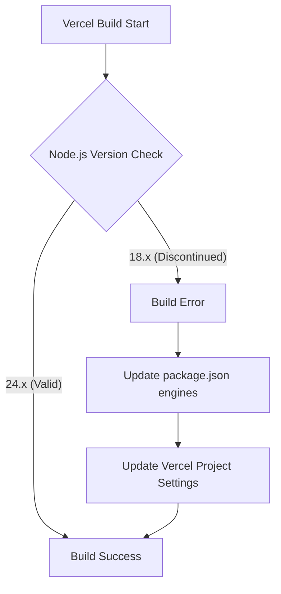

# AI Knowledge Base - Portfolio

Este arquivo contém o histórico de decisões técnicas, regras de negócio e configurações críticas do projeto.

## Histórico de Decisões e Mudanças

### [2026-05-14] Atualização da Versão do Node.js

A Vercel reportou um erro de build devido ao uso da versão 18.x do Node.js (descontinuada/inválida para o ambiente atual). A versão foi atualizada para 24.x para garantir compatibilidade com o runtime da Vercel.

#### Gráfico de Fluxo de Erro


#### Arquivos Modificados
| Arquivo | Mudança | Motivo |
| :--- | :--- | :--- |
| `package.json` | Adicionado campo `engines` com `node: 24.x` | Corrigir erro de build na Vercel e padronizar ambiente. |

#### Lógica de Decisão
```text
IF build_environment == "vercel" AND node_version < 24
THEN set node_version = 24.x
ELSE maintain current configuration
```

#### Comportamento da Feature
- Garante que o ambiente de build utilize uma versão moderna e suportada do Node.js.
- Evita avisos de obsolescência no deploy.

#### Checklist de Aceite
- [x] Campo `engines` adicionado ao `package.json`.
- [x] Documentação da mudança no `AI_KNOWLEDGE_BASE.md`.
- [x] Instrução para atualizar as configurações no dashboard da Vercel fornecida ao usuário.
